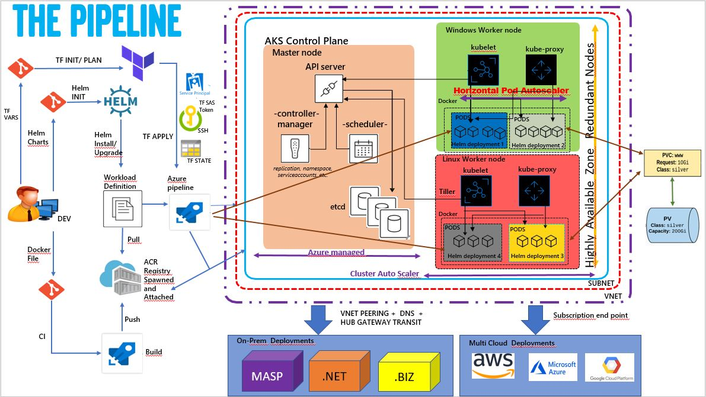

## Introduction

### What's this repo about?

This repo was designed to get anyone up and running self-hosted Azure DevOps Agents on Azure's managed Kubernetes service, AKS.
Everything will be deployed as code, and the walkthrough can be completed in under an hour!

By the end of you will have bootstrapped:
- A Terraform backends..
- A working [Kubernetes](http://kubernetes.io) cluster
- A Container Registry
- A couple of self-hosted Azure Pipelines Agents using the [Helm](https://helm.sh) package manager

and deployed a Wordpress application via a Pipeline running on those same agents. 

### **
[Let's get started!](doc/01_prereqs.md)
**

Below is the architecture

